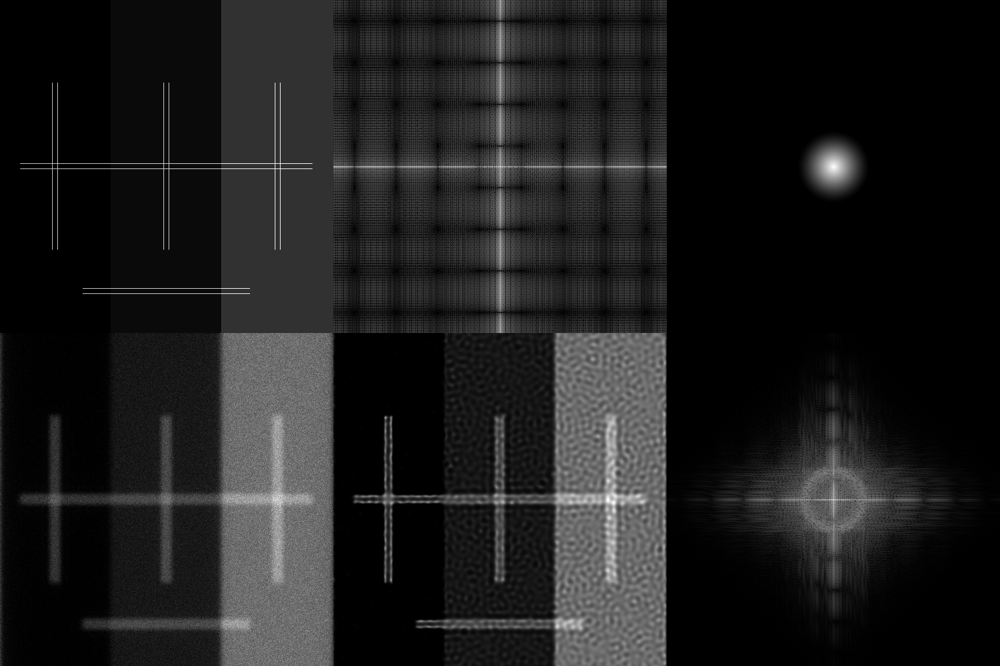

# RL positivity demonstration

A simple simulation to show the effect of the positivity constraint in Richardson-Lucy deconvolution.
Originally written in MATLAB, this code can be successfully run in [Octave](https://www.gnu.org/software/octave/) after installing and loading the [statistics package](https://octave.sourceforge.io/statistics/index.html) from [Octave Forge](https://octave.sourceforge.io/).
Support for GPU acceleration is provided through the `USE_GPU` flag, but is overkill for the example ground truth provided by default.

## Example results



The image above shows results of the simulation when run using the following parameters:
```
max_photons = 100;
num_iter = 100;
pixel_size = 20;
spacing_px = 4;
n = 512;
lambda = 510;
numerical_aperture = 1.4;
background_level = 0;
left_bg = 0;
mid_bg = 0.05;
right_bg = 0.25;
```
As the RNG seed is not set before each run, the results will vary slightly in noise profile every time the simulation is repeated.
Here, the line-pair spacing is 80 nm, while the resolution limit of the imaging system is ~180 nm.
Despite this, RL produces an output with a distinctly resolved line pair in the region with zero background.
The line pair remains an unresolved 'block' in regions with a higher background level.
